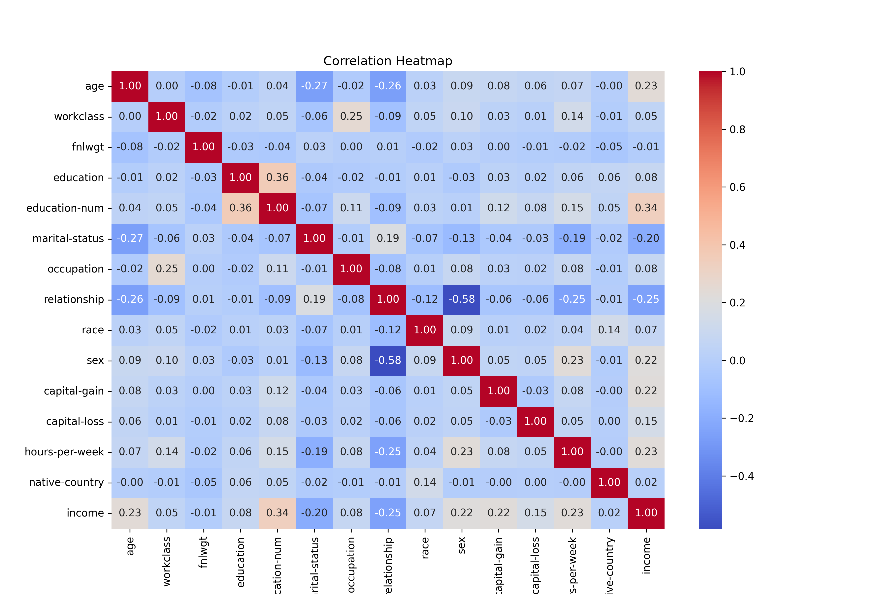

# Predicting Income Categories Using Machine Learning

This project aims to predict whether an individual's income exceeds $50,000 per year using machine learning models based on census data from the Adult Income dataset. The project involves data preprocessing, exploratory data analysis (EDA), model development, and evaluation.

## Table of Contents
- [Dataset](#dataset)
- [Installation](#installation)
- [Data Preprocessing](#data-preprocessing)
- [Exploratory Data Analysis](#exploratory-data-analysis)
  - [Dataset Statistics](#dataset-statistics)
  - [Income Distribution](#income-distribution)
  - [Pairplot of Features](#pairplot-of-features)
  - [Correlation Heatmap](#correlation-heatmap)
- [Model Development and Evaluation](#model-development-and-evaluation)
- [Model Comparison](#model-comparison)

## Dataset

The dataset used in this project is the Adult Income dataset, which can be found in the UCI Machine Learning Repository. It contains demographic and employment-related features and a target variable indicating whether the income of an individual exceeds $50,000.

- **File:** `./adult.csv`
- **Columns:**
  - age
  - workclass
  - fnlwgt
  - education
  - education-num
  - marital-status
  - occupation
  - relationship
  - race
  - sex
  - capital-gain
  - capital-loss
  - hours-per-week
  - native-country
  - income

## Installation

To run this project, you will need to have Python installed along with the required libraries. The `requirements.txt` file contains all the dependencies.

1. Clone the repository:
    ```bash
    git clone https://github.com/yourusername/income-prediction.git
    cd income-prediction
    ```

2. Install the required packages:
    ```bash
    pip install -r requirements.txt
    ```

## Data Preprocessing

Data preprocessing involves handling missing values, encoding categorical variables, and normalizing numerical features. Progress bars have been implemented to track the progress of these tasks.

## Exploratory Data Analysis

Exploratory Data Analysis (EDA) was performed to understand the distribution and relationships between the features and the target variable.

### Dataset Statistics

The basic statistics of the dataset were plotted as a bar chart.


### Income Distribution

The distribution of the income categories was visualized using a count plot.


### Pairplot of Features

The relationships between various features and income were visualized using a pairplot.


### Correlation Heatmap

The correlation between the features was visualized using a heatmap.



## Model Development and Evaluation

Three machine learning models were developed and evaluated:

1. **Logistic Regression**
2. **Decision Tree**
3. **Random Forest**

Progress spinners were used to indicate the training process for each model.

## Model Comparison

The models were compared based on their accuracy, precision, recall, and F1 score. The results are summarized below:

| Model               | Accuracy | Precision |   Recall  | F1 Score |
|---------------------|----------|-----------|-----------|----------|
| Logistic Regression | 0.825878 | 0.706955  | 0.452463  | 0.551779 |
| Decision Tree       | 0.809807 | 0.595477  | 0.614520  | 0.604849 |
| Random Forest       | 0.857099 | 0.732523  | 0.624892  | 0.674440 |


## Conclusion

This project demonstrates how machine learning can be used to predict income categories using the Adult Income dataset. By comparing different classifiers, the most effective model for accurate income prediction can be identified, providing valuable insights for socio-economic research and policy-making.

